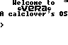
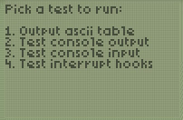

# Vera - the Calc Lover's OS

This repository is an attempt to collect the brave repeated undertakings of
several people from the TI graphing calculator scene to build their own
operating system for the calculator from scratch. This project became known as
"Vera". To my knowledge, three separate but related attempts have been made that
resulted in actual code.

My role in the first two attempts was limited (I remember I came up with the
name Vera, which is nice). The third attempt was my own pet project.

## Contributing

If you have more files or links or know more about this than I do, please send
your pull requests my way 😄

## Generation 1 _(early 2006)_



It's not clear to me who wrote this version. I think it started on the UnitedTI
forums. It references `Jim's stuff :)` in the comments at some point, that's
undoubtedly "Jim e" from the forums.

The code is pretty small and has a singular purpose, but I think the real
achievement lies in being able to generate a ROM file from scratch that boots
on a calculator and then does anything without being able to depend on the
original OS's subroutines, like outputting some text and getting some input.

## Generation 2 _(late 2006, early 2007)_

Again, I've forgotten who put this together. But we have some actual
documentation this time, which mentions a couple of people by name:

```
this file contains the names of the people who wrote code for Vera or whose code was stolen for Vera:
-Jim e ...
-Timendus ...
-flopus maximus, Benjamin Moody
-Jacobbus, Jacob van Ginkel
-and of course all the other people form UnitedTI
maybe I forget some add them please

sources where we ripped most of the code from:
-the API
-Pong OS
-wiki ti
-and more
```

I see my nickname there, although I can't seem to remember actively contributing
code to this project. So that's probably just because they ripped "the API",
which was a project of mine that I added lots of routines to (it was an online
routines repository, the contemporary equivalent of which would be something
like npm).

The ROM file doesn't seem to do very much or to be very stable, unfortunately.
But still, it manages to boot the calculator and respond to keypresses, which is
already quite impressive.

These's also lots of code. Clearly the author(s) tried to provide a more generic
API as an abstraction of the hardware for programmers.

## Generation 3 _(late 2007)_



Project announced and discussed here:
http://maxcoderz.org/forum/viewtopic.php?f=3&t=2524

This is the version of Vera I started. The original plan was to write it in C
using [sdcc](http://sdcc.sourceforge.net/), but a lack of experience with that
(or rather: the abundance of experience in writing 'pure' z80) in the community
made quick work of those plans.

Being in university and studying computer science, I started this project with
documentation and testing in mind. So a tool was written (taking ideas from
JavaDoc) to generate HTML documentation from comments in the assembly source
files. The tool (although pretty crappy) has survived and [can be found here](Generation 3/asmdoc tool).
Also, we have two versions of the generated documentation website, that can be
seen in the [docs directory](Generation 3/docs). The screenshot above shows
several "tests" that had been implemented. How very rigorous of young me 😄

The actual Vera source is a different story though. The code was hosted in an
SVN repository that was on my private server. Somehow I can't find the code on
any of my computers anymore, and the server is long gone. I'm sure it can still
be recovered somewhere in the mess that is my collection of ancient PCs, but all
attempts so far have failed. The only file I have is one that I copy-pasted on
a forum somewhere.

We do have an actual running ROM file though, so that's fun. The above
screenshot shows off all of its features 🥳
